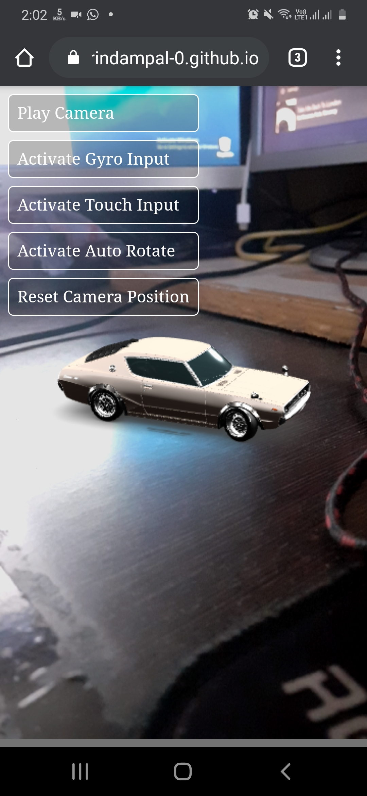
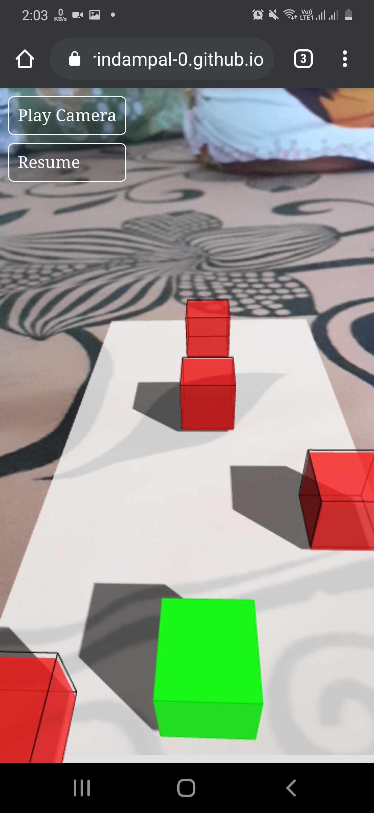

# Web Reality

Car Visualization       | AR Game
:----------------------:|:-----------------:
 | 

## About
---

This project explores the possibility of Virtual and Augmented Reality on Web.

This can be experienced best on an Android Phone with camera, gyroscope sensor and a web browser preferably chrome.

Currently it contains 2 examples of AR application, one simple game and a car visualization.

Try this yourself on the Github pages linked below and have fun, its not great yet, but its a start.

[WebReality Github pages](https://arindampal-0.github.io/WebReality)

## Using Web Reality

If you want to host it on you PC and run on local network, follow steps below

### **Requirements**
* nodejs
* npm
* git

### **Installation**
Clone repository in the directory of your liking.
```bash
git clone https://github.com/ArindamPal-0/WebReality.git
```

Generate SSL Certificate for https or else you can't access camera and other sensors on mobile
Use openssl for the same, openssl is already installed on linux distributions.
On Windows systems download and install openssl from [Win32OpenSSL](https://slproweb.com/products/Win32OpenSSL.html) and add to path.

Create a seperate folder for certificate.
Inside the WebReality folder...
```bash
mkdir certificate
cd certificate
openssl genrsa -out key.pem
openssl req -new -key key.pem -out csr.pem
openssl x509 -req -days 365 -in csr.pem -signkey key.pem -out cert.pem
cd ..
```

Make sure to create the certificate before running the nodejs server.


Install required node modules, this command will install all the node dependencies listed in `package.json`
```bash
npm install
```

Make sure to install *nodemon* for testing purposes
```bash
npm install -g nodemon
```

Change directory back to the WebReality folder and start the server in the terminal.
```bash
nodemon server
```
or
```bash
node server
```

On Windows Systems set execution policy to unrestricted or else you won't be able to run the server.
Open powershell as administrator and ...
```powershell
Set-ExecutionPolicy unrestricted
```

Now your server is running at https://localhost:3000 if you did not change the port number.

Connect mobile to the same network as that your PC running the server and open the url.
AND HAVE FUN...

## Goal

The main goal of this project is to create Augmented and Virtual Reality Content on the Web, so feel free to help out with you ideas and code. :grin:

## Contribution

You may request or ask questions regarding the project in the [issues](https://github.com/ArindamPal-0/WebReality/issues) page, as currently the project is only maintained by me, it may take time to respond and make required changes. Please consider forking the repository and contributing to its development. :heart:
